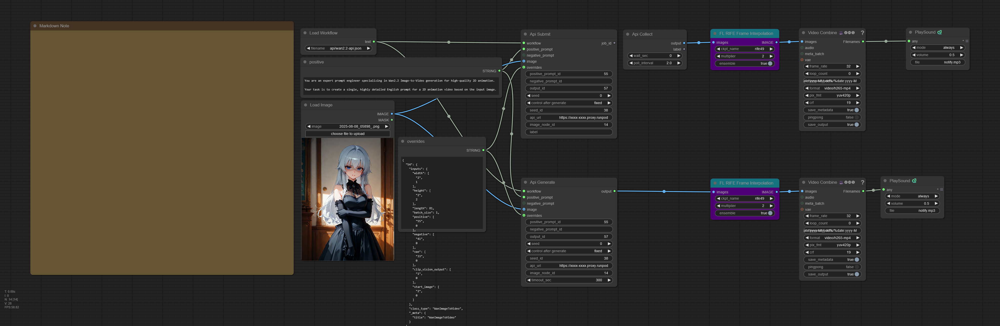
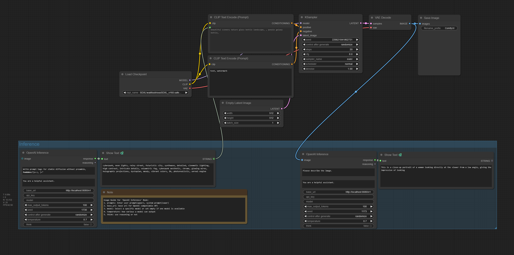

# ComfyUI-API-Pack

[English](README.md) | [한국어](README_ko.md)

Nodes that call external APIs: remote ComfyUI API execution, Grok image-to-video, and OpenAI-compatible inference.

## Installation

1. Clone or copy this repository into the `custom_nodes` directory of your ComfyUI installation.
2. Install dependencies:
   ```bash
   pip install -r requirements.txt
   ```
3. Restart ComfyUI.

## Provided Nodes

### API Nodes (`ApiPack/API`)



Run a workflow on a remote ComfyUI instance over its HTTP API (e.g. a [RunPod](https://www.runpod.io/) pod or any reachable ComfyUI). All nodes take the **API-format** workflow JSON (ComfyUI menu: "Save (API Format)"), not the UI workflow format. `api_url` is the remote base URL, e.g. `https://xxxx-8188.proxy.runpod.net/` or `http://127.0.0.1:8188`.

| Node | Description |
|------|-------------|
| **Load Workflow** | Loads an API-format workflow JSON from `ComfyUI/user/default/workflows/` and returns it as a STRING. |
| **Api Generate** | Sends a workflow to a remote ComfyUI, waits for completion, and returns the output image/frames. |
| **Api Submit** | Fire-and-forget submit; records the job and returns immediately with a `job_id` (does not wait). |
| **Api Collect** | Collects the in-flight job submitted by Api Submit; returns frames when ready, otherwise blocks downstream. |

#### Load Workflow

| Parameter | Type | Default | Description |
|-----------|------|---------|-------------|
| `filename` | ENUM | (required) | A `.json` file under `user/default/workflows/` |

| Output | Description |
|--------|-------------|
| `text` | The workflow JSON contents |

#### Api Generate

| Parameter | Type | Default | Description |
|-----------|------|---------|-------------|
| `workflow` | STRING (input) | (required) | API-format workflow JSON string, or path to a file |
| `positive_prompt` | STRING (input) | (required) | Positive prompt, injected into `positive_prompt_id` |
| `positive_prompt_id` | STRING | (required) | Node id receiving the positive prompt |
| `negative_prompt_id` | STRING | "" | Node id receiving `negative_prompt` (when provided) |
| `output_id` | STRING | "" | Node id whose `images`/`gifs` output is fetched and decoded |
| `seed` | INT | -1 | `-1` keeps the workflow's existing seed |
| `seed_id` | STRING | "" | Node id whose `seed`/`noise_seed` input receives `seed` |
| `api_url` | STRING | "" | Remote ComfyUI base URL, e.g. `https://xxxx-8188.proxy.runpod.net/` or `http://127.0.0.1:8188` |
| `image_node_id` | STRING | "" | LoadImage node id receiving the uploaded `image` |
| `timeout_sec` | INT | 300 | Max polling time in seconds (1–36000) |
| `negative_prompt` | STRING (input) | "" | Optional. Skipped if empty |
| `image` | IMAGE | (optional) | Optional. Uploaded to the remote and bound to `image_node_id` |
| `overrides` | STRING (input) | "" | Optional JSON `{node_id: <full node dict>}`; each entry **replaces the entire node entry**, applied last |

| Output | Description |
|--------|-------------|
| `output` | Decoded image/frame tensor (animated outputs are expanded to frames) |

#### Api Submit

Same inputs as **Api Generate** (minus `timeout_sec`), plus an optional `label`. This is an OUTPUT_NODE, so it runs even when nothing consumes its output.

| Parameter | Type | Default | Description |
|-----------|------|---------|-------------|
| `label` | STRING | "" | Optional label recorded with the job (returned later by Api Collect) |

| Output | Description |
|--------|-------------|
| `job_id` | The submitted job id (empty string if a job is already in progress) |

#### Api Collect

| Parameter | Type | Default | Description |
|-----------|------|---------|-------------|
| `wait_sec` | INT | 0 | `0` = collect if ready, else skip immediately; otherwise wait up to this many seconds (0–36000) |
| `poll_interval` | FLOAT | 2.0 | Seconds between polls while waiting (0.5–60.0) |

| Output | Description |
|--------|-------------|
| `output` | Collected frames when ready; otherwise an `ExecutionBlocker` that skips downstream |
| `label` | The label recorded at submit time |

> **One in-flight job per kind:** The API and [Grok](#grok-nodes-apipackgrok) nodes share a single `jobs.lock` (in the pack directory) but each kind gets its own slot — an API job and a Grok job can both be in flight, but only one of each. Submit skips if a job of that kind is already in flight, and Collect frees the slot once it finishes. Run Collect in a loop (e.g. `/loop`) to pick up the result when it's done.

---

### Grok Nodes (`ApiPack/Grok`)

| Node | Description |
|------|-------------|
| **Grok Generate** | Generates a Grok Imagine image-to-video clip from a single image and saves it to the output folder as a native VIDEO (with inline preview). |
| **Grok Submit** | Fire-and-forget submit; sends the generation request and returns immediately with a `request_id` (does not wait). |
| **Grok Collect** | Collects the in-flight job submitted by Grok Submit; returns the VIDEO when ready, otherwise blocks downstream. |

#### Grok Generate

| Parameter | Type | Default | Description |
|-----------|------|---------|-------------|
| `image` | IMAGE | (required) | Source image (first frame) |
| `prompt` | STRING | "" | Motion / scene description (optional) |
| `duration` | INT | 5 | Clip length in seconds (1–15) |
| `resolution` | ENUM | "720p" | "720p" or "480p" |
| `model` | STRING | "grok-imagine-video-1.5-preview" | Grok video model |
| `filename_prefix` | STRING | "grok/GrokVideo" | Output path prefix under the ComfyUI output directory |
| `poll_interval` | INT | 5 | Seconds between status polls (1–60) |
| `timeout` | INT | 600 | Max seconds to wait for generation (30–3600) |
| `access_token` | STRING | "" | Optional. Falls back to `GROK_ACCESS_TOKEN` env var |
| `refresh_token` | STRING | "" | Optional. Falls back to `GROK_REFRESH_TOKEN` env var |
| `client_id` | STRING | "" | Optional. Falls back to `GROK_CLIENT_ID` env var |

| Output | Description |
|--------|-------------|
| `video` | Generated clip (with audio), also previewed inline on the node |

> **Credentials:** Provide the three tokens as node inputs, or leave them empty to read `GROK_ACCESS_TOKEN` / `GROK_REFRESH_TOKEN` / `GROK_CLIENT_ID` from the environment. The access token is auto-refreshed on a 401/403.

#### Grok Submit

Same inputs as **Grok Generate** (minus `poll_interval`/`timeout`), plus an optional `label`. This is an OUTPUT_NODE, so it runs even when nothing consumes its output. The mp4 output path is reserved at submit time and recorded in the lock; Collect writes to it when the clip is ready.

| Parameter | Type | Default | Description |
|-----------|------|---------|-------------|
| `label` | STRING | "" | Optional label recorded with the job (returned later by Grok Collect) |

| Output | Description |
|--------|-------------|
| `request_id` | The submitted job's request id (empty string if a Grok job is already in progress) |

#### Grok Collect

| Parameter | Type | Default | Description |
|-----------|------|---------|-------------|
| `wait_sec` | INT | 0 | `0` = collect if ready, else skip immediately; otherwise wait up to this many seconds (0–3600) |
| `poll_interval` | FLOAT | 5.0 | Seconds between polls while waiting (0.5–60.0) |
| `access_token` | STRING | "" | Optional. Falls back to `GROK_ACCESS_TOKEN` env var |
| `refresh_token` | STRING | "" | Optional. Falls back to `GROK_REFRESH_TOKEN` env var |
| `client_id` | STRING | "" | Optional. Falls back to `GROK_CLIENT_ID` env var |

| Output | Description |
|--------|-------------|
| `video` | Collected clip when ready; otherwise an `ExecutionBlocker` that skips downstream |
| `label` | The label recorded at submit time |

> **Credentials at collect:** Collect also calls the Grok API (to poll/download), so it re-reads the tokens from its inputs or the env — tokens are **not** persisted in the lock file. Provide them the same way as on Grok Generate.

> **One in-flight job per kind:** The Grok and [API](#api-nodes-apipackapi) nodes share a single `jobs.lock` (in the pack directory) but each kind gets its own slot — a Grok job and an API job can both be in flight, but only one of each. Submit skips if a job of that kind is already in flight, and Collect frees the slot once it finishes. Run Collect in a loop (e.g. `/loop`) to pick up the clip when it's done.

---

### Inference Nodes (`ApiPack/Inference`)



| Node | Description |
|------|-------------|
| **OpenAI Inference** | Generate text via any OpenAI-compatible API. Supports vision and thinking mode. |
| **Clef Decide** | Zero-shot classification with a Clef decision model served by llama-server: probabilities for typed questions about a state. |

#### OpenAI Inference

A single node for every OpenAI-compatible backend — OpenAI, vLLM, Ollama's `/v1` endpoint, and Gemini's OpenAI-compatible endpoint. Just point `base_url`/`api_key`/`model` at the server you want.

| Parameter | Type | Default | Description |
|-----------|------|---------|-------------|
| `prompt` | STRING | "Hello, world!" | User prompt |
| `system_instruction` | STRING | "You are a helpful assistant." | System prompt |
| `base_url` | STRING | "" | API base URL, e.g. `https://api.openai.com/v1` (or set `OPENAI_BASE_URL` in `.env`) |
| `api_key` | STRING | "" | API key (or set `OPENAI_API_KEY` in `.env`) |
| `model` | STRING | "" | Model name. If empty, auto-detected from `/models` when exactly one is available |
| `max_output_tokens` | INT | 100 | Maximum output tokens (up to 131072) |
| `seed` | INT | 0 | Random seed |
| `temperature` | FLOAT | 0.7 | Sampling temperature (0.0–2.0) |
| `think` | BOOLEAN | False | Enable thinking mode |
| `image` | IMAGE | (optional) | Input image for vision tasks |

| Output | Description |
|--------|-------------|
| `response` | The model's answer (with any `<think>` block stripped out) |
| `reasoning` | The reasoning/thinking trace, from `reasoning_content` or an inline `<think>...</think>` block (empty if none) |

> **Note:** Responses are cached in-memory (LRU, last 10 unique input combinations) — re-running an identical request returns the cached response without calling the API.

#### Clef Decide

Sends `state`, `questions` and `image` to llama-server's `/v1/systemone` endpoint, serving a Clef decision model such as [clef-flash](https://huggingface.co/Cloudflare/clef-flash). The model returns a probability for every option of every question instead of generating text. Use it for zero-shot classification: write the labels in `criteria` and the model scores them without any training on your data.

| Parameter | Type | Default | Description |
|-----------|------|---------|-------------|
| `state` | STRING | "" | Content to evaluate |
| `questions` | STRING | one `noul` question | JSON object mapping a question id to a typed question |
| `base_url` | STRING | "http://localhost:8082" | llama-server base URL |
| `api_key` | STRING | "" | API key, sent as a Bearer token when set |
| `model` | STRING | "" | Model name, sent when set |
| `image` | IMAGE | (optional) | Images placed before the state, one per batch item. The server must be started with `--mmproj` |

| Output | Description |
|--------|-------------|
| `answers` | The response's `answers` as JSON, keyed by question id |

Question types:

| Type | `criteria` | Answer |
|------|------------|--------|
| `choice` | `{"option": "description" or null, ...}` | `choice`, `confidence`, `probabilities` |
| `score` | `["lowest", ..., "highest"]` (2 to 10 levels) | expected `score`, `confidence`, `legend`, `probabilities` |
| `noul` | optional `{"true": "description", "false": "description"}` | probability of true |

```json
{
  "route": {
    "type": "choice",
    "instructions": "Which team should handle the message?",
    "criteria": {"billing": "Payments or invoices", "technical": "Bugs or outages"}
  },
  "urgency": {"type": "score", "instructions": "How urgent is it?", "criteria": ["Can wait", "This week", "Today"]},
  "outage": {"type": "noul", "instructions": "Is a service down?"}
}
```

## Configuration

> **`.env` is optional** — the pack always loads without it. Copy [`.env.example`](.env.example) to `.env` and set only the variables you need (or pass the same values as node inputs). A node that needs a credential it can't find raises a clear error (shown as a ComfyUI error dialog) **when you run it**; nothing fails at load time.

### OpenAI Inference defaults (`.env` or node inputs)

The **OpenAI Inference** node reads `base_url`/`api_key` from the node inputs first, falling back to these `.env` variables when the inputs are empty:

```
OPENAI_BASE_URL=https://api.openai.com/v1
OPENAI_API_KEY=your-api-key
```

### Grok credentials (`.env` or node inputs)

The **Grok** nodes (Generate / Submit / Collect) read their credentials from the node inputs first, falling back to these `.env` variables when the inputs are empty:

```
GROK_ACCESS_TOKEN=...
GROK_REFRESH_TOKEN=...
GROK_CLIENT_ID=...
```

The access token is auto-refreshed on a 401/403. If you hit a `Grok token refresh failed (...)` error, the refresh token or client_id has expired/been revoked — re-authenticate with x.ai and update these values.

## License

GPL-3.0 License
