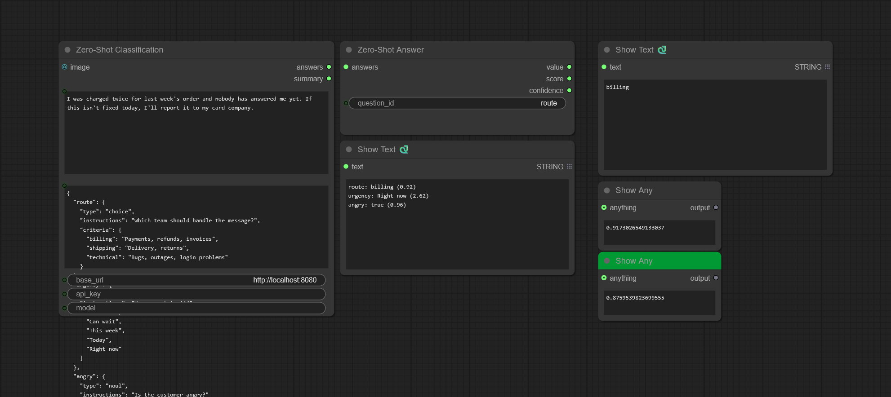

# ComfyUI-API-Pack

[English](README.md) | [한국어](README_ko.md)

Nodes that call external APIs: zero-shot classification on llama-server, OpenAI-compatible inference,
remote ComfyUI API execution and Grok image-to-video.

## Example



The zero-shot workflow asks three questions about a customer message. **Zero-Shot Classification** answers all of
them in one request and prints one line per question, and **Zero-Shot Answer** picks out the `route` answer.


The inference workflow writes prompts with **OpenAI Inference** and generates an image from them.


The API workflow loads a workflow with **Load Workflow** and runs it on a remote ComfyUI, once with **Api Generate**
and once with **Api Submit** and **Api Collect**.

## Usage

### Zero-Shot Classification

Write the labels in `questions`, feed the text into `state`, read the answers out of `summary` and `answers`. It calls
`/v1/systemone` on a llama-server running a decision model such as
[clef-flash](https://huggingface.co/Cloudflare/clef-flash), which scores every label in one forward pass instead of
generating text.

| Widget | What it does |
|--------|--------------|
| `state` | The content to classify |
| `questions` | A JSON object mapping a question id to a typed question, see below |
| `base_url` | llama-server base URL. Default `http://localhost:8082` |
| `api_key` | Sent as a Bearer token when set |
| `model` | Sent when set. A server with one model ignores it |
| `image` (input) | Images placed before the state, one per batch item. The server must be started with `--mmproj` |
| `answers` (output) | The response's `answers` as indented JSON, keyed by question id |
| `summary` (output) | One `id: value (score)` line per question, with value and score as in **Zero-Shot Answer** |

| Type | `criteria` | Answer |
|------|------------|--------|
| `choice` | `{"option": "description" or null, ...}` | `choice`, `confidence`, `probabilities` |
| `score` | `["lowest", ..., "highest"]`, 2 to 10 levels | expected `score`, `confidence`, `legend`, `probabilities` |
| `noul` | Optional `{"true": "description", "false": "description"}` | `noul`, the probability of true |

```json
{
  "route": {
    "type": "choice",
    "instructions": "Which team should handle the message?",
    "criteria": {"billing": "Payments or invoices", "technical": "Bugs or outages"}
  },
  "urgency": {"type": "score", "instructions": "How urgent is it?", "criteria": ["Can wait", "This week", "Today"]},
  "outage": {"type": "noul", "instructions": "Is a service down?"}
}
```

With the state `Our checkout started returning errors and orders are blocked.`, `summary` is:

```
route: technical (0.96)
urgency: Today (1.88)
outage: true (0.81)
```

The same input always gives the same answers. There is no `temperature`, `top_k`, `top_p` or `seed`: nothing is
sampled, and the model file fixes how the probabilities are scaled.

### OpenAI Inference

Feed a prompt into **OpenAI Inference**, read the answer out of `response`. Works with any OpenAI-compatible backend:
OpenAI, vLLM, Ollama's `/v1` endpoint, Gemini's OpenAI-compatible endpoint.

| Widget | What it does |
|--------|--------------|
| `prompt` / `system_instruction` | User and system prompts |
| `base_url` | API base URL, e.g. `https://api.openai.com/v1`. Empty reads `OPENAI_BASE_URL` |
| `api_key` | Empty reads `OPENAI_API_KEY` |
| `model` | Empty picks the model from `/models` when the server has exactly one |
| `max_output_tokens` | Up to 131072. Default 100 |
| `seed` / `temperature` | Sampling. `temperature` 0.0 to 2.0, default 0.7 |
| `think` | Turns on thinking mode |
| `image` (input) | Input image for vision models |
| `response` (output) | The answer, with any `<think>` block stripped out |
| `reasoning` (output) | The thinking trace from `reasoning_content` or an inline `<think>...</think>` block, empty if none |

The last 10 distinct requests are cached in memory, so running an identical request again does not call the API.

### Api Generate / Api Submit / Api Collect

Run a workflow on a remote ComfyUI over its HTTP API, such as a [RunPod](https://www.runpod.io/) pod. The workflow is
the **API-format** JSON (ComfyUI menu: "Save (API Format)"), not the UI format. **Api Generate** waits for the result;
**Api Submit** returns a `job_id` at once and **Api Collect** picks the result up later.

| Widget | What it does |
|--------|--------------|
| `workflow` (input) | API-format workflow JSON, or a path to one. **Load Workflow** reads one from `user/default/workflows/` |
| `api_url` | Remote ComfyUI base URL, e.g. `https://xxxx-8188.proxy.runpod.net/` or `http://127.0.0.1:8188` |
| `positive_prompt` (input) / `positive_prompt_id` | The prompt and the node id that receives it |
| `negative_prompt` (input) / `negative_prompt_id` | Same for the negative prompt. Skipped when empty |
| `seed` / `seed_id` | The seed and the node whose `seed`/`noise_seed` receives it. `-1` keeps the workflow's seed |
| `image` (input) / `image_node_id` | An image uploaded to the remote and bound to that LoadImage node |
| `output_id` | The node whose `images`/`gifs` output is fetched. Animated outputs become frames |
| `overrides` (input) | JSON `{node_id: <full node dict>}`. Each entry replaces the whole node, applied last |
| `timeout_sec` | Api Generate only. Polling limit in seconds, default 300 |
| `label` | Api Submit only. Recorded with the job and returned by Api Collect |
| `wait_sec` / `poll_interval` | Api Collect only. `wait_sec` 0 collects if ready and otherwise skips at once |

Api Collect returns the frames when the job is done. Otherwise it returns an `ExecutionBlocker`, which skips the nodes
downstream.

### Grok Generate / Grok Submit / Grok Collect

Turn one image into a Grok Imagine video clip, saved to the output folder as a native VIDEO with an inline preview.
**Grok Generate** waits for the clip; **Grok Submit** returns a `request_id` at once and **Grok Collect** picks the
clip up later.

| Widget | What it does |
|--------|--------------|
| `image` (input) | The first frame |
| `prompt` | Motion or scene description, optional |
| `duration` / `resolution` | 1 to 15 seconds, `720p` or `480p` |
| `model` | Default `grok-imagine-video-1.5-preview` |
| `filename_prefix` | Output path under the ComfyUI output directory. Default `grok/GrokVideo` |
| `poll_interval` / `timeout` | Grok Generate polling. Defaults 5 and 600 seconds |
| `access_token` / `refresh_token` / `client_id` | Empty reads `GROK_ACCESS_TOKEN` / `GROK_REFRESH_TOKEN` / `GROK_CLIENT_ID`. The access token refreshes itself on a 401/403 |
| `label` | Grok Submit only. Recorded with the job and returned by Grok Collect |
| `wait_sec` / `poll_interval` | Grok Collect only. `wait_sec` 0 collects if ready and otherwise skips at once |

Grok Collect calls the Grok API too, so it needs the tokens as well. They are not stored with the job.

The API and Grok nodes keep one in-flight job each in `jobs.lock` in the pack directory. Submit skips while a job of
its kind is in flight, and Collect frees the slot once it finishes. Run Collect in a loop (e.g. `/loop`) to pick up
the result when it is done.

## Installation

Search for **ComfyUI-API-Pack** in ComfyUI Manager, or:

```bash
cd ComfyUI/custom_nodes
git clone https://github.com/alchemine/comfyui-api-pack
pip install -r comfyui-api-pack/requirements.txt
```

## Nodes

`ApiPack/Inference`

**Zero-Shot Answer**: picks one question out of the Zero-Shot Classification `answers`.

| Output | `choice` | `score` | `noul` |
|--------|----------|---------|--------|
| `value` (STRING) | The chosen option | The description of the nearest level | `"true"` if the probability is 0.5 or more, else `"false"` |
| `score` (FLOAT) | Probability of the chosen option | Expected level | Probability of true |
| `confidence` (FLOAT) | `confidence` | `confidence` | `\|2p - 1\|`, as for a two-option `choice` |

`ApiPack/API`

**Load Workflow**: reads an API-format workflow JSON from `user/default/workflows/` as a STRING.

## Configuration

`.env` is optional. Copy [`.env.example`](.env.example) to `.env` and set only what you use; the node inputs take
priority over it. A missing credential raises an error when the node runs, not when the pack loads.

```
OPENAI_BASE_URL=https://api.openai.com/v1
OPENAI_API_KEY=your-api-key

GROK_ACCESS_TOKEN=...
GROK_REFRESH_TOKEN=...
GROK_CLIENT_ID=...
```

A `Grok token refresh failed (...)` error means the refresh token or client_id has expired or been revoked:
re-authenticate with x.ai and update them.

## License

GPL-3.0. See [LICENSE](LICENSE).
